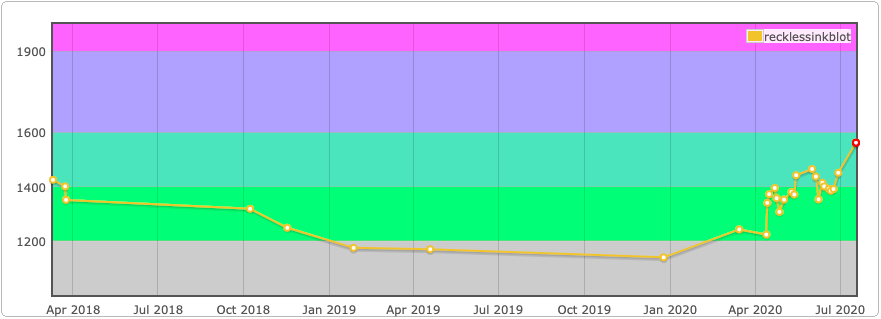

Started taking competitive programming seriously around March 2020.

In-depth Stats: [https://clist.by/coder/recklessinkblot/](https://clist.by/coder/recklessinkblot/)

**last updated: August 23rd, 2020**



- weekly-contest-199 `169/14309`, Top `1.18%`
- biweekly-contest-31 `1865/8677`, Top `21.49%`
- weekly-contest-198 `677/15152`, Top `4.55%`
- weekly-contest-197 `170/13832`, Top `1.23%`
- biweekly-contest-30 `1415/8174`, Top `17.3%`
- weekly-contest-194 `1328/13806`, Top `9.61%`
- weekly-contest-193 `2240/13794`, Top `16.24%`
- weekly-contest-192 `1252/13805`, Top `9.07`
- weekly-contest-191 `1833/13283`, Top `13.8%`
- biweekly-contest-27 `1010/7924`, Top `12.5%`
- weekly-contest-190 `1361/11840`, Top `12.5%`
- weekly-contest-189 `164/13036`, Top `1.26%`
- weekly-contest-188 `442/12716`, Top `3.48%`
- weekly-contest-187 `940/12353`, Top `7.61%`
- biweekly-contest-25, `1210/7699`, Top `15.72%`
- weekly-contest-186, `1559/11684` Top `13.34%`
- weekly-contest-185, `1246/14200`, Top `8.77%` (Excuse: I cut my hand making breakfast after biweekly-contest-24 and I had to do this injured)
- biweekly-contest-24, `2190/7729`, Top `28.33%`
- weekly-contest-184, `411/13663`, Top `3.00%`
- weekly-contest-183, `767/12542`, Top `6.12%`
- weekly-contest-182, `162/11694`, Top `1.39%`
- weekly-contest-181, `1117/10930`, Top `10.22%`
- weekly-contest-180, `1194/10047`, Top `11.88%`
- weekly-contest-179, `693/9847`, Top `7.04%`
- weekly-contest-178, `363/9210`, Top `3.94%`
- weekly-contest-162, `927/6058`, Top `15.3%`
- weekly-contest-141, `1224/4126`, Top `29.67%`
- weekly-contest-140, `694/4047`, Top `17.15%`
- weekly-contest-139, `1161/3985`, Top `29.13%`
- weekly-contest-137, `1369/4091`, Top `33.46%`
- weekly-contest-133, `472/4862`, Top `9.71%`
- weekly-contest-128, `988/5166`, Top `19.13%`
- weekly-contest-127, `1031/4735`, Top `21.77%`
- weekly-contest-123, `846/3714`, Top `22.78%`
- weekly-contest-122, `1342/3485`, Top `38.51%`
- weekly-contest-121, `1547/3924`, Top `39.42%`
- weekly-contest-120, `1861/3876`, Top `48.01%`
- weekly-contest-119, `1348/3848`, Top `35.03%`
- weekly-contest-114, `1421/3199`, Top `44.42%`
- weekly-contest-109, `1523/3386`, Top `44.98%`
- weekly-contest-107, `1556/3714`, Top `41.9%`
- weekly-contest-105, `1348/3528`, Top `38.21%`
- weekly-contest-104, `1570/3580`, Top `43.85%`
- weekly-contest-103, `847/4162`, Top `20.35%`
- weekly-contest-102, `1135/4387`, Top `25.87%`
- weekly-contest-100, `735/4008`, Top `18.34%`
- weekly-contest-98, `525/3552`, Top `14.78%`
- weekly-contest-97, `1285/3762`, Top `34.16%`
- weekly-contest-96, `979/4704`, Top `20.81%`
- weekly-contest-94, `918/4542`, Top `20.21%`
- weekly-contest-92, `1252/4508`, Top `27.77%`
- weekly-contest-91, `1007/4227`, Top `23.82%`
- weekly-contest-89, `625/3646`, Top `17.14%`
- weekly-contest-87, `706/3029`, Top `23.31%`
- weekly-contest-86, `514/2699`, Top `19.04%`
- weekly-contest-85, `827/2997`, Top `27.59%`
- weekly-contest-84, `584/3076`, Top `18.99%`
- weekly-contest-83, `827/2745`, Top `30.13%`
- weekly-contest-81, `578/2797`, Top `20.66%`
- weekly-contest-79, `391/2485`, Top `15.73%`
- weekly-contest-77, `836/2982`, Top `28.03%`
- weekly-contest-76, `865/2849`, Top `30.36%`
- weekly-contest-75, `614/2830`, Top `21.7%`
- weekly-contest-74, `1117/2675`, Top `41.76%`
- weekly-contest-72, `639/2382`, Top `26.83%`
- weekly-contest-71, `184/2475`, Top `7.43%`
- weekly-contest-70, `557/2555`, Top `21.8%`
- weekly-contest-69, `726/2573`, Top `28.22%`
- weekly-contest-67, `802/2865`, Top `27.99%`
- weekly-contest-by-app-academy, `1230/1999`, Top `61.53%`
- weekly-contest-58, `796/2514`, Top `31.66%`
- leetcode-weekly-contest-55, `1947/3037`, Top `64.11%`
- leetcode-weekly-contest-53, `1589/2934`, Top `54.16%`
- leetcode-weekly-contest-52, `1140/2615`, Top `43.59%`
- leetcode-weekly-contest-46, `1072/2389`, Top `44.87%`
- leetcode-weekly-contest-45, `963/2292`, Top `42.02%`
- leetcode-weekly-contest-44, `932/2272`, Top `41.02%`
- leetcode-weekly-contest-41, `921/2174`, Top `42.36%`
- leetcode-weekly-contest-40, `1027/2133`, Top `48.15%`
- leetcode-weekly-contest-38, `771/2034`, Top `37.91%`
- leetcode-weekly-contest-37, `1563/1999`, Top `78.19%`
- leetcode-weekly-contest-36, `1063/1985`, Top `53.55%`
- leetcode-weekly-contest-35, `772/1679`, Top `45.98%`
- leetcode-weekly-contest-34, `559/1557`, Top `35.9%`
- leetcode-weekly-contest-33, `611/1665`, Top `36.7%`
- leetcode-weekly-contest-32, `535/1744`, Top `30.68%`
- leetcode-weekly-contest-31, `518/1551`, Top `33.4%`
- leetcode-weekly-contest-30, `976/1517`, Top `64.34%`
- leetcode-weekly-contest-29, `1354/1663`, Top `81.42%`
- leetcode-weekly-contest-28, `397/1848`, Top `21.48%`
- leetcode-weekly-contest-25, `1050/1841`, Top `57.03%`
- leetcode-weekly-contest-24, `749/1930`, Top `38.81%`
- leetcode-weekly-contest-23, `770/1864`, Top `41.31%`
- leetcode-weekly-contest-22, `840/2046`, Top `41.06%`
- leetcode-weekly-contest-21, `788/1988`, Top `39.64%`

### Codeforces Contests

Rating: `1581`

Max Rating: `1581`

Rank: `Specialist`

[Profile](https://codeforces.com/contests/with/recklessinkblot)

- Codeforces Round \#667 Div3, Rank `684`, Solved `4`
- Codeforces Round \#661 Div3, Rank `346`, Solved `4`
- Educational Codeforces Round 92 Div 2, Rank `11317`, Solved `1`
- Codeforces Round \#658 Div 2, Rank `6837`, Solved `2`
- Codeforces Round \#656 Div 3, Rank `423`, Solved `4`
- Codeforces Round \#653 Div 3, Rank `1311`, Solved `5`
- Codeforces Round \#652 Div 2, Rank `4805`, Solved `3`
- Codeforces Round \#651 Div 2, Rank `5548`, Solved `3`
- Codeforces Global Round 8, Rank `5970`, Solved `2`
- Codeforces Round \#650 Div 3, Rank `2883`, Solved `3` (Unranked (for a small subset of people) due to problem D judge issues)
- Codeforces Round \#649 Div 2, Rank `5270`, Solved `2`
- Educational Codeforces Round 89 Div 2, Rank `3102`, Solved `3`
- Codeforces Round \#648 Div 2, Rank `9782`, Solved `1`
- Codeforces Round \#647 Div 2, Rank `5251`, Solved `3`
- Codeforces Round \#646 Div 2, Rank `4482`, Solved `2`
- Codeforces Round \#642 Div 3, Rank `1792`, Solved `4`
- Codeforces Round \#641 Div 2, Rank `5597`, Solved `1`
- Codeforces Round \#640 Div 4, Rank `2631`, Solved `4`
- Codeforces Round \#639 Div 2, Rank `4418`, Solved `2` (Unranked due to server issues)
- Codeforces Round \#638 Div 2, Rank `5501`, Solved `2`
- Educational Codeforces Round 86 Div 2, Rank `10178`, Solved `1`
- Codeforces Round \#637 Div 2, Rank `8925`, Solved `1`
- Codeforces Round \#636 Div 3, Rank `3903`, Solved `3`
- Codeforces Round \#635 Div 2, Rank `4953`, Solved `2`
- Codeforces Round \#634 Div 3, Rank `2144`, Solved `4`
- Codeforces Round \#633 Div 2, Rank `7738`, Solved `2`
- Codeforces Round \#628 Div 2, Rank `3497`, Solved `3`
- Codeforces Round \#610 Div 2, Rank `4512`, Solved `1`
- Codeforces Round \#553 Div 2, Rank `3411`, Solved `1`
- Educational Codeforces Round 29 Div 2, Rank `4178`, Solved `1`
- Codeforces Round \#521, Rank `3802`, Solved `2`
- Lyft Level 5 Challenge 2018, Rank `2492`, Solved `2`
- Codeforces Round \#472 Div 2, Rank `1972`, Solved `1`
- Codeforces Round \#471 Div 2, Rank `1583`, Solved `1`
- Codeforces Round \#470 Div 2, Rank `2304`, Solved `1`

### BinarySearch.io

[Profile](https://binarysearch.io/@/recklessinkblot)

Ranking `20th`

Peak Ranking `6th`

Rating `1793`

Max Rating `1801`

Participated `12`

Weekly Contest Rankings:

- Contest 23: Placed `35th` solved 2/4 scored 7 points and solved in 42 minutes, 20 seconds
- Contest 21: Placed `32nd` solved 1/4 Scored 4 points and solved in 51 minutes, 38 seconds
- Contest 16: Placed `37th` solved 3/4 scored 12 points and solved in 86 minutes, 42 seconds
- Contest 15: Placed `20th` solved 2/4 scored 9 points and solved in 24 minutes, 32 seconds
- Contest 14: Placed `7th` solved 3/4 scored 12 points and solved in 44 minutes, 55 seconds
- Contest 13: Placed `10th` solved 2/4 scored 7 points and solved in 14 minutes, 25 seconds
- Contest 12: Placed `8th` solved 3/4 scored 12 points and solved in 22 minutes, 44 seconds
- Contest 11: Placed `15th` solved 2/4 scored 7 points and solved in 17 minutes, 43 seconds
- Contest 10: Placed `8th` solved 4/4 scored 18 points and solved in 79 minutes, 28 seconds
- Contest 9: Placed `16th` solved 3/4 scored 12 points and solved in 51 minutes, 0 seconds
- Contest 8: Placed `18th` solved 2/4 scored 7 points and solved in 14 minutes, 57 seconds
- Contest 7: Placed `10th` solved 3/5 scored 12 points and solved in 39 minutes, 19 seconds
- Contest 6: Placed `12th` solved 3/4 scored 12 points and solved in 24 minutes, 4 seconds
- Contest 5: Placed `15th` solved 3/4 scored 12 points and solved in 49 minutes, 37 seconds (Unranked due to server issues)
- Contest 4: Placed `23rd` solved 2/4 scored 7 points and solved in 28 minutes, 29 seconds

Educational Unranked Contests:

- Contest 8: Ranked 26th
- Contest 7: Ranked 12th
- Contest 6: Ranked 14th
- Contest 5: Ranked 20th
- Contest 4: Ranked 5th
- Contest 3: Ranked 9th
- Contest 2: Ranked 9th
- Contest 1: Ranked 4th

### Local Waterloo ACM Contests

[Local Waterloo ACM Contests](https://uwaterloo.ca/international-collegiate-programming-contest/past-local-contest-results)

Previous results:
- `34/51` Solved 2 in [Winter 2018](http://acm.student.cs.uwaterloo.ca/~acm00/180210score.html)
- `25/31` Solved 2 in [Spring 2018](http://acm.student.cs.uwaterloo.ca/~acm00/180616score.html)
- `49/73` Solved 1 in [Fall 2018](http://acm.student.cs.uwaterloo.ca/~acm00/180930score.html)
- `27/43` Solved 1 in [Winter 2019](http://acm.student.cs.uwaterloo.ca/~acm00/190209score.html)
- `n/a` Solved 0 in [Spring 2019](http://acm.student.cs.uwaterloo.ca/~acm00/190622score.html)
- `n/a` skipped Fall 2019 contest
- `n/a` Solved 0 in [Winter 2020](http://acm.student.cs.uwaterloo.ca/~acm00/200201score.html)
- `26/38` Solved 1 in [Spring 2020](http://acm.student.cs.uwaterloo.ca/~acm00/200725score.html)
- `25/66` Solved 1 in [Fall 2020](http://acm.student.cs.uwaterloo.ca/~acm00/201024score.html)

### Topcoder

User name:             `recklessinkblot`

Rating (highest):      `1156` (1156)
